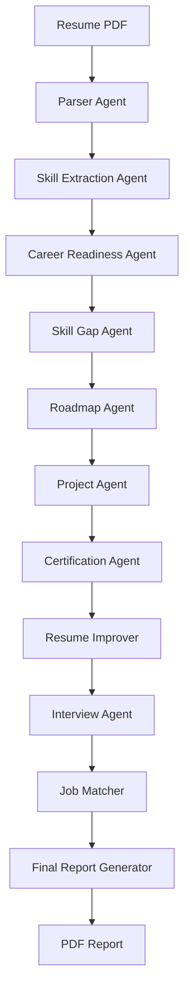

  

# CareerForge AI

### Multi-Agent Career Intelligence System

Built using **LLMs • LangChain • Ollama • AMD AI Compute**

## 📖 Overview

**CareerForge AI** is a **Multi-Agent Career Intelligence System** built using **LLMs, LangChain, Ollama (Qwen)** and **AMD AI Compute**.

The system acts as an autonomous AI career mentor by orchestrating multiple specialized AI agents that work together to analyze resumes, identify technical and soft skills, calculate career readiness, detect skill gaps, recommend personalized learning roadmaps, suggest projects and certifications, prepare interview questions, match job roles, and generate a comprehensive career report.

Unlike traditional resume analyzers, CareerForge AI follows an **Agentic AI architecture**, where each agent is responsible for a dedicated task while collaborating with others to deliver intelligent end-to-end career guidance.

# ✨ Key Features

- 📄 Intelligent Resume Parsing
- 🧠 AI-powered Skill Extraction
- 📊 Career Readiness Score
- 🔍 Skill Gap Detection
- 🗺 Personalized Learning Roadmap
- 💡 AI Project Recommendation
- 🎓 Certification Recommendation
- 📝 Resume Improvement Suggestions
- 🎤 Interview Preparation Agent
- 💼 Job Matching Agent
- 📈 Interactive Visualizations
- 📑 Professional PDF Report Generation
- 🤖 Multi-Agent AI Pipeline
- ⚡ Powered by Ollama + Qwen LLM

# 🛠 Tech Stack

| Category | Technologies |
|----------|--------------|
| Programming Language | Python |
| LLM | Qwen |
| Framework | LangChain |
| LLM Runtime | Ollama |
| Notebook Environment | Jupyter Notebook |
| Data Processing | Pandas, NumPy |
| Visualization | Matplotlib, Plotly |
| PDF Processing | PDFPlumber, PyPDF |
| Report Generation | FPDF, ReportLab |
| AI Platform | AMD AI Compute |

# 🏗 System Architecture

